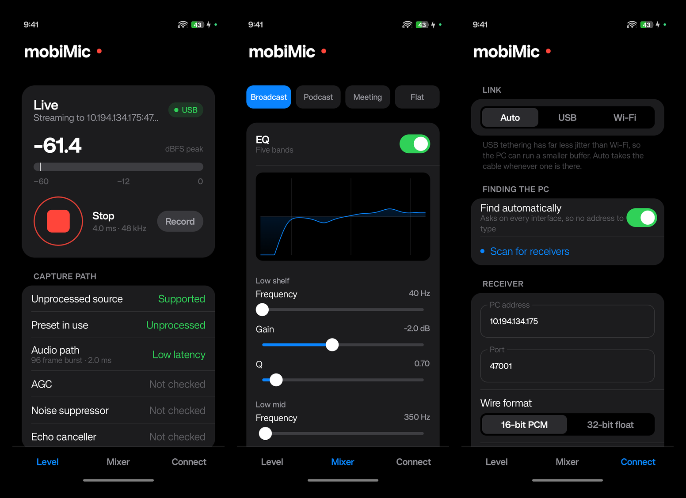
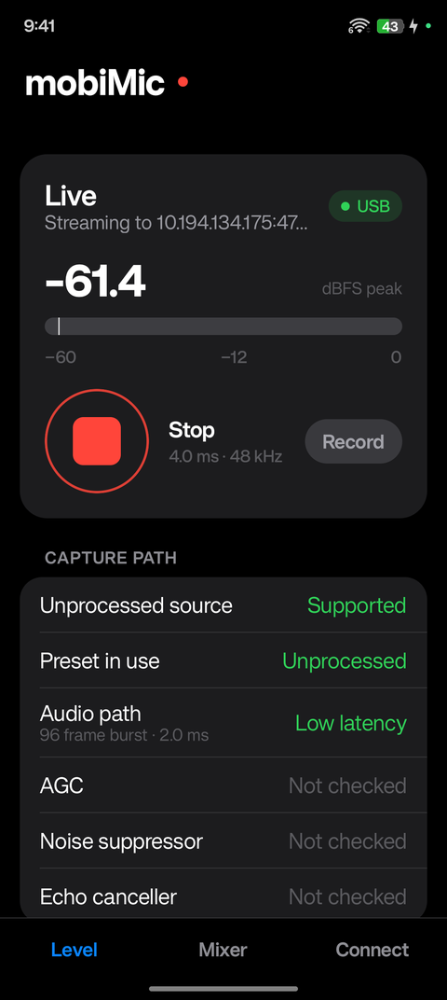
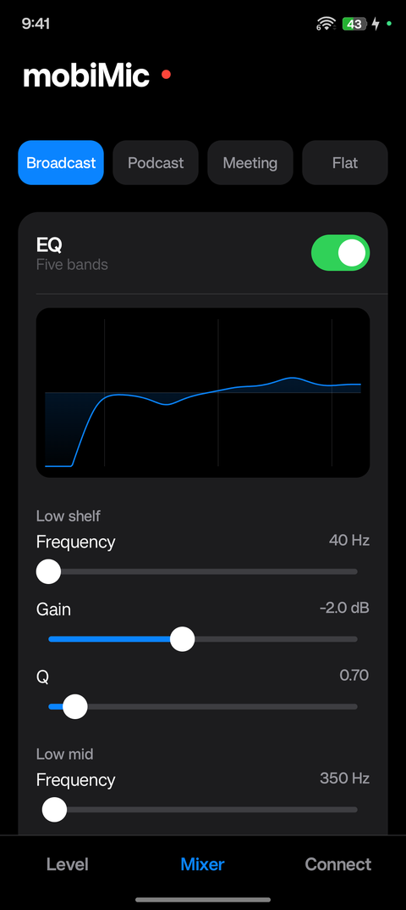
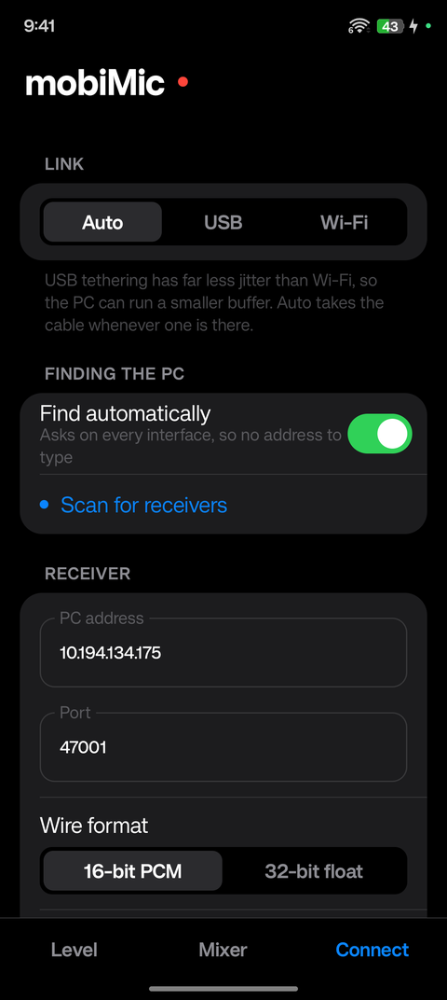

<div align="center">

# mobiMic

**Turn your Android phone into a low-latency studio microphone for Windows.**

Captures *unprocessed* audio on the phone, runs a broadcast-style DSP chain on it in C++,
and streams it over Wi-Fi or USB into a virtual audio cable — so Windows sees your phone
as an ordinary microphone, in Discord, OBS, Zoom, Audacity or any DAW.



[](https://developer.android.com)
[](pc/receiver.py)
[](https://github.com/google/oboe)
[](LICENSE)

</div>

---

## Why another phone-as-microphone app?

Most apps in this category record through Android's default voice path, which means your
audio has already been through automatic gain control, noise suppression and echo
cancellation before it ever leaves the phone. That processing is tuned for phone calls. It
gates your pauses, rides your levels, and cannot be undone afterwards.

mobiMic takes the other approach:

- **It asks for the unprocessed capture path** (`InputPreset::Unprocessed`), verifies what
  it actually got, and tells you plainly when a device refuses.
- **It does its own processing**, in a chain you control, after the signal is captured
  clean — not before.
- **It measures instead of assuming.** Latency, XRuns, callback load, packet loss, jitter
  and clock drift are all on screen, because "it sounds fine" is not a measurement.

Every performance number in this README was measured on real hardware. See
[docs/DEVICE-TEST-RESULTS.md](docs/DEVICE-TEST-RESULTS.md) for the methodology and the
bugs those measurements found.

---

## Features

**Capture**
- Unprocessed input via [Oboe](https://github.com/google/oboe)/AAudio, 48 kHz, mono
- Automatically finds the lowest-latency configuration a device will actually grant —
  measured 2 ms callbacks where a naive implementation gets 20 ms
- Optional override that force-disables AGC, noise suppression and echo cancellation
- Reports honestly when the device applies processing it will not let you turn off

**Real-time DSP** (C++, in the audio callback, zero allocation)
- 24 dB/oct high-pass · noise gate with hysteresis and hold
- 5-band parametric EQ using topology-preserving transform filters, so live parameter
  changes do not click
- Split-band de-esser · log-domain compressor with soft knee · oversampled saturation
- Lookahead brickwall limiter
- Spectral noise suppression (STFT, minimum statistics, decision-directed Wiener)
- Factory presets: Broadcast, Podcast, Meeting, Flat

**Transport**
- Uncompressed PCM over UDP, 812 kbit/s, versioned packet header
- Works over **Wi-Fi or USB tethering**, with automatic link selection
- Zero-configuration discovery — the phone finds the PC, no IP address to type

**Windows receiver** (Python)
- Adaptive jitter buffer with packet-loss concealment
- **Clock-drift correction** — a PI controller and fractional resampler cancel the
  phone-to-PC crystal difference, which is what lets it run for hours instead of minutes
- Feeds [VB-CABLE](https://vb-audio.com/Cable/) so any Windows app sees a normal mic

---

## Screenshots

| Level | Mixer | Connect |
|:--:|:--:|:--:|
|  |  |  |
| Live level, capture-path verification and stream health | Full DSP chain with a response curve drawn from the real filters | Wi-Fi or USB, automatic receiver discovery |

---

## Measured performance

On a realme RMX3842 (Android 16, arm64) streaming to Windows 11:

| | USB tether | Wi-Fi |
|---|---|---|
| Capture burst | 2.0 ms | 2.0 ms |
| DSP latency | 2.0 ms (7.3 ms with noise suppression) | same |
| Jitter buffer | **30 ms** | 40 ms |
| Network jitter | 1.4–2.6 ms | 1.8–3.1 ms |
| Packets lost / reordered | 0 / 0 | 0 / 0 |
| Underruns in 90 s | 1 | 4 |
| **Phone + buffer total** | **≈ 39 ms** | **≈ 49 ms** |

CPU cost on the audio thread, as a fraction of the 2 ms callback deadline:

| Configuration | Callback load | XRuns |
|---|---|---|
| Capture only | 3.6 % | 0 |
| Full chain (Broadcast preset) | 12.7 % | 0 |
| Full chain + noise suppression | 37.2 % | 0 |

Raw capture verification, 13.6 s of a quiet room: noise floor steady at −63 to −65 dBFS,
**0 of 136 blocks gated to digital silence**, no AGC breathing.

---

## Quick start

### 1. Windows

Install [VB-CABLE](https://vb-audio.com/Cable/) (admin, then reboot) and set it to 48 kHz
in Sound settings → `CABLE Input` → Advanced.

> VB-CABLE's installer makes itself the default playback **and** recording device, which
> routes all your system audio into the cable. Set your real speakers and microphone back
> as defaults afterwards — mobiMic addresses the cable by name and does not need to be
> the default.

```bash
pip install -r pc/requirements.txt
python pc/receiver.py
```

### 2. Phone

```bash
./gradlew :app:installDebug
```

Open mobiMic, grant the microphone permission, press **Scan for receivers** on the
Connect tab, then **Start** on the Level tab.

### 3. Anywhere you want the mic

Set the input device to **CABLE Output (VB-Audio Virtual Cable)** — in Discord, OBS,
Zoom, Audacity, Reaper, wherever.

For lower latency, enable **USB tethering** on the phone and set the link to Auto or USB.

Full setup, tuning and troubleshooting: **[docs/USAGE.md](docs/USAGE.md)**.

---

## How it works

```
 Android phone                                        Windows PC
┌───────────────────────────────┐                 ┌──────────────────────────────┐
│ mic capsule                   │                 │  UDP receiver thread         │
│   ↓ Oboe / AAudio (2 ms)      │                 │    ↓                         │
│ unprocessed capture           │                 │  jitter buffer + concealment │
│   ↓ lock-free SPSC ring       │   UDP 47001     │    ↓                         │
│ DSP chain (C++, no alloc)     │ ──────────────► │  drift PI + resampler        │
│   HPF→gate→NS→EQ→de-ess→      │  812 kbit/s     │    ↓                         │
│   comp→sat→limiter            │  Wi-Fi or USB   │  WASAPI → VB-CABLE           │
│   ↓ float→int16 + dither      │                 │    ↓                         │
│ UDP sender thread             │                 │  any Windows app             │
└───────────────────────────────┘                 └──────────────────────────────┘
```

Three rules shape the whole design:

1. **Nothing blocks the audio thread.** No allocation, no locks, no JNI, no file I/O.
   Parameters cross to it as a triple-buffered POD block; audio leaves through a
   lock-free ring.
2. **Loss is concealed, never waited for.** UDP with concealment beats TCP with
   retransmission stalls for live audio.
3. **The two clocks are never assumed to match.** Every packet carries a monotonic frame
   index, which is what makes drift correction possible at all.

Architecture and build plan: **[ROADMAP.md](ROADMAP.md)**.

---

## Requirements

| | |
|---|---|
| Phone | Android 8.0 (API 26) or newer, arm64 or x86_64 |
| PC | Windows 10/11, Python 3.11+, [VB-CABLE](https://vb-audio.com/Cable/) |
| Network | Both devices on the same LAN, or a USB cable with tethering |
| Build | Android Studio / Gradle, NDK and CMake (fetched automatically) |

AAudio needs API 26; below that Oboe silently falls back to OpenSL ES and the
low-latency and unprocessed guarantees disappear, which is why `minSdk` is 26.

---

## Project layout

```
app/src/main/cpp/          audio engine, DSP and transport (C++17)
  AudioEngine.cpp            Oboe stream, path selection, drain thread
  dsp/                       filters, dynamics, FFT, noise suppression
  net/                       packet format and UDP sender
app/src/main/java/…/audio/   Kotlin facade, settings, effect overrides
app/src/main/java/…/net/     link detection and receiver discovery
app/src/main/java/…/ui/      Jetpack Compose interface
pc/receiver.py             Windows receiver: jitter buffer, drift control, WASAPI
pc/udp_probe.py            minimal packet inspector for debugging
docs/                      measured results and usage guide
```

---

## Roadmap

- [x] Unprocessed capture with device verification
- [x] UDP transport with drift-corrected receiver
- [x] Full DSP chain with live-tunable parameters
- [x] Spectral noise suppression
- [x] USB tethering with zero-config discovery
- [ ] Learned noise suppression (RNNoise / DeepFilterNet behind the existing interface)
- [ ] Opus for congested networks
- [ ] Lower receiver-side latency — WASAPI scheduling is now the largest single term
- [ ] macOS and Linux receivers
- [ ] Packaged receiver with a tray icon

---

## Contributing

Issues and pull requests are welcome. The one thing worth knowing before touching the
audio path: **measure, do not assume.** Several of this project's biggest wins came from
probing what a device actually does rather than trusting what the API implies — the 10x
latency improvement came from discovering that a phone offers its fast input path in
16-bit only, and silently drops float requests onto a slow path with no error.

If you change anything on the audio thread, keep it allocation-free and lock-free, and
check the callback-load figure on the Level tab before and after.

---

## Keywords

Android microphone for PC · use phone as microphone on Windows · wireless microphone app ·
USB microphone from phone · low latency audio streaming · real-time audio DSP · Oboe
AAudio unprocessed capture · virtual audio cable · VB-CABLE · noise suppression ·
compressor limiter EQ · UDP audio streaming · jitter buffer · clock drift correction ·
Jetpack Compose · Kotlin · C++ audio · OBS microphone · Discord microphone

---

## License

[MIT](LICENSE) © Amol Bangare
